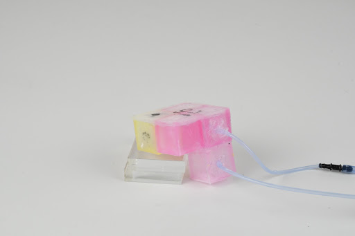
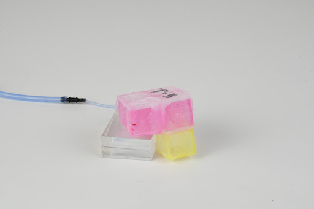

## faq

### **Who funded the R&D behind voxcraft?**
Voxcraft is supported by the National Science Foundation’s Emerging Frontiers in Research and Innovation (EFRI) Continuum, Compliant, and Configurable Soft Robotics Engineering (C3 SoRo) program (Subaward [EFMA-1830870](https://nsf.gov/awardsearch/showAward?AWD_ID=1830870)).
 

### **How do I cite voxcraft?**

If you use our simulator, please [cite it](https://voxcraft.github.io/design#cite)!
 
To reference our build method please cite 
our [2019 RSS](/research#2019) and [2020 RoboSoft](/research#2020) papers which introduce and refine the build protocol, respectively.
 

### **My voxels are leaking!**

SilPoxy is the Soft Robotics Panacea (cure-all). 
Silicone bonds well to other silicones, but not so well to commercial tubing. 
We think it's because the commercial tubing is more fully cured, and maybe coated with something. 
SilPoxy bonds to almost anything. 
Other tips: make sure the 5-walled voxels are fully contacting the final 6th face 
(one of the last steps, when you use the rulers and silicone to make a big sheet).
Try inflating the voxels underwater in a transparent cup to determine the location of the leak(s). 
Inspect the voxels that leak, and look for trends. 
It might point you to a part of your mold that is cracked, 
or maybe you accidentally poked the neighboring voxels when you added tubing.
 

### **Should each virtual vox model a single physical vox?**

There does not need to be a one-to-one correspondence between virtual and physical voxels.
For example, these two voxelbots:
 
 
were modeled using 27 virtual voxels per physical voxel:

See our RoboSoft 2020 [paper](/research#2020) for more details.
 

### **My question isn't listed here!**

Please [contact us](/team) so we can help you and update our FAQ.

Design questions should be sent to [Sam](/team#sam).

Kit / build questions should be sent to [Dylan](/team#dylan).

