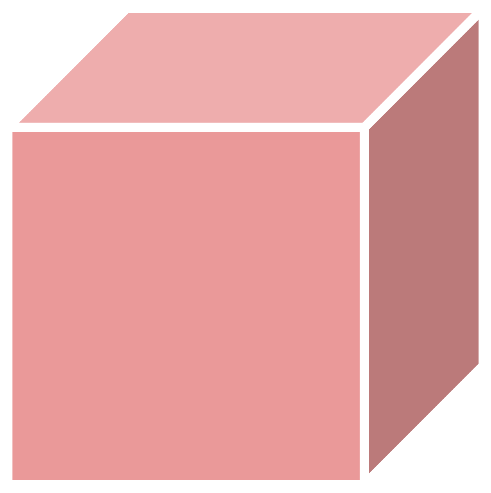
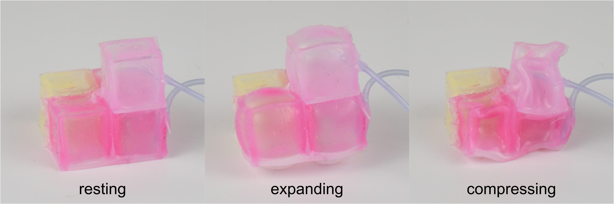

## about

<!-- 

 -->

 
In voxcraft everything starts with a **voxel**: a hollow silicone block that can expand and contract in volume. 
When multiple voxels are attached together they become a robot: a **voxelbot**. 
  

The **behavior** of a voxelbot depends on the arrangement of its voxels (its body shape) and how they expand/contract, which is controlled by a hand pump or a motor.
  

_There are endless designs waiting to be discovered!_

### **Ready to start?**
All the materials you need to build your own voxelbots are linked in our [kit](/kit).

### **Not sure what to build?**
You can try out some designs in [simulation](/design) before deciding which one you want to make. We provide a graphical user interface, a headless physics engine (cpu and gpu-accelerated versions) for interfacing with machine learning platforms, as well as an evolutionary design package.

### **Have the kit and a design in mind?**
It’s time to [build](/build) it!

### **Did you make something cool?**
[Send us](/team) pictures/videos of your voxelcraft creatures and we’ll add them to our [zoo](/zoo).

### **Are you stuck?**
Check out our [FAQ](/faq). If you can’t find the answer to your question there, please [email us](/team).

### **Did you discover something new?**
The AI and robotics communities are hungry for better/faster/cheaper ways to design and manufacture soft robots. 
Publish a [research](/research) paper detailing your innovation!
Great venues include conferences such as 
[RoboSoft](http://robosoft2020.org/)
and
[ALife](http://2020.alife.org/),
and journals such as 
[Soft Robotics](https://home.liebertpub.com/publications/soft-robotics/616/)
and 
[Science Robotics](https://robotics.sciencemag.org/).

### **Want to contribute to voxcraft?**
We’d love to hear from you about how to improve voxcraft: send someone on our [team](/team) a message!

